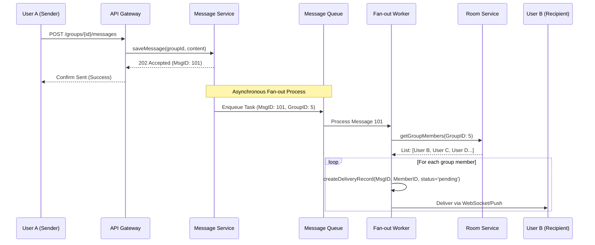
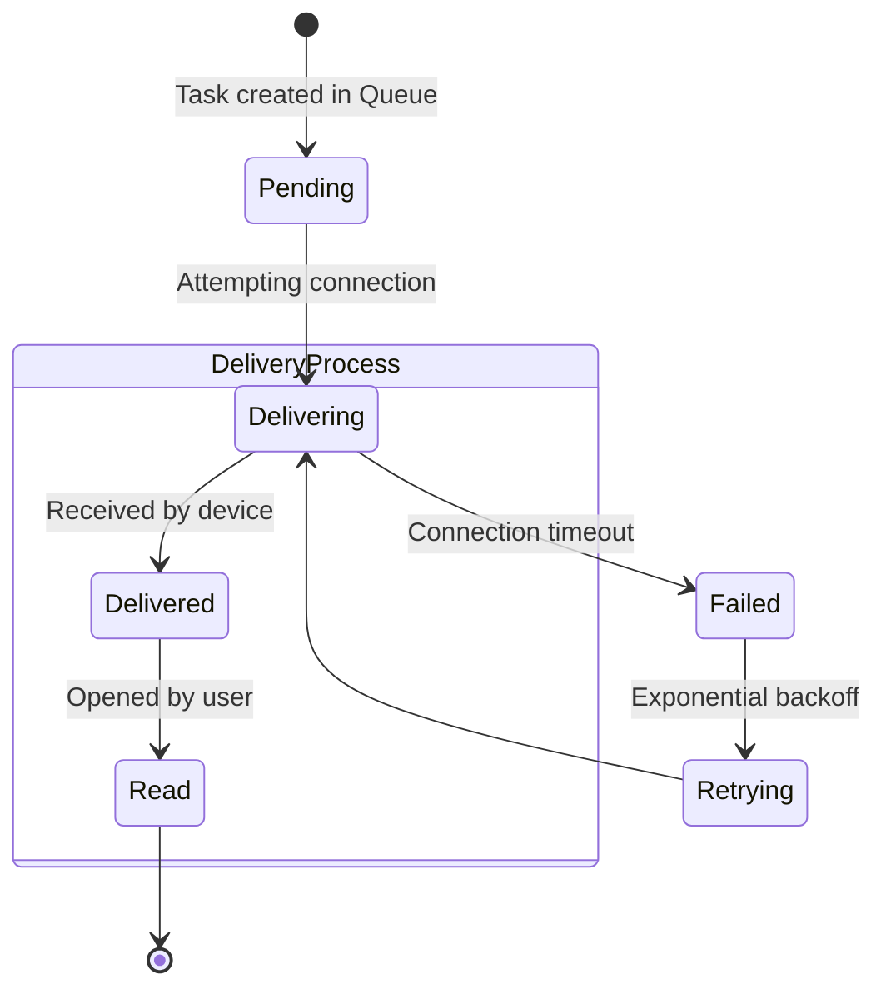

🧪 Laboratory Work 1
Variant 4 — Group Chat

Focus: Scaling delivery logic & Per-recipient status tracking

🧱 Part 1 — Component Diagram

To scale group messaging, we utilize the Fan-out pattern.
This allows the primary API to respond quickly to the sender while background workers handle distribution to every group member.

```mermaid
graph TD
    Client[Client App] --> API[API Gateway]
    API --> AuthService[Auth Service]
    API --> RoomService[Room / Group Service]
    API --> MsgService[Message Service]
    
    RoomService --> RoomDB[(Group Metadata DB)]
    MsgService --> MsgDB[(Message Store)]
    
    MsgService --> Queue{Delivery Queue}
    Queue --> FanOut[Fan-out Worker]
    
    FanOut --> RoomService : "Get members list"
    FanOut --> StatusDB[(Delivery Status DB)]
    FanOut --> PushService[Push / WebSocket Service]
    
    PushService --> Recipient[Recipient Clients]
```
    
🔁 Part 2 — Sequence Diagram
Scenario

User A sends a message to a group. The system immediately confirms receipt and then asynchronously distributes it to other participants (User B, C, D, …).



🔄 Part 3 — State Diagram
Object

GroupMessageStatus — message state relative to a specific recipient.
We track the message state per participant to determine who has received or read it.



📚 Part 4 — ADR (Architecture Decision Record)
ADR-004: Using Fan-out on Write for Group Messaging

Status: Accepted

Context

In a group chat system, a single message must be delivered to 2–10,000+ participants.

We need to ensure:

Low latency for the sender

Ability to track delivered/read status individually

Decision

We implement a Fan-out on Write strategy using a message queue:

Message Service persists the original message and enqueues a "fan-out" task

Fan-out Worker consumes the task, retrieves the group member list, and creates individual delivery records

Statuses stored in NoSQL DB (e.g., DynamoDB, Cassandra) using a composite key (message_id + user_id) for scalable writes

Alternatives

Fan-out on Read: Clients pull messages instead of pushing

Hard to implement real-time delivery and read receipts

Synchronous Fan-out: Sender request distributes messages

Timeout risk for large groups (500+ users)

Consequences

Performance: Sender receives immediate confirmation

Reliability: Failed worker → task stays in queue for retry

Data Volume: Status records grow linearly → O(N) per message

Complexity: Requires queue infrastructure (RabbitMQ / Kafka) and workers
