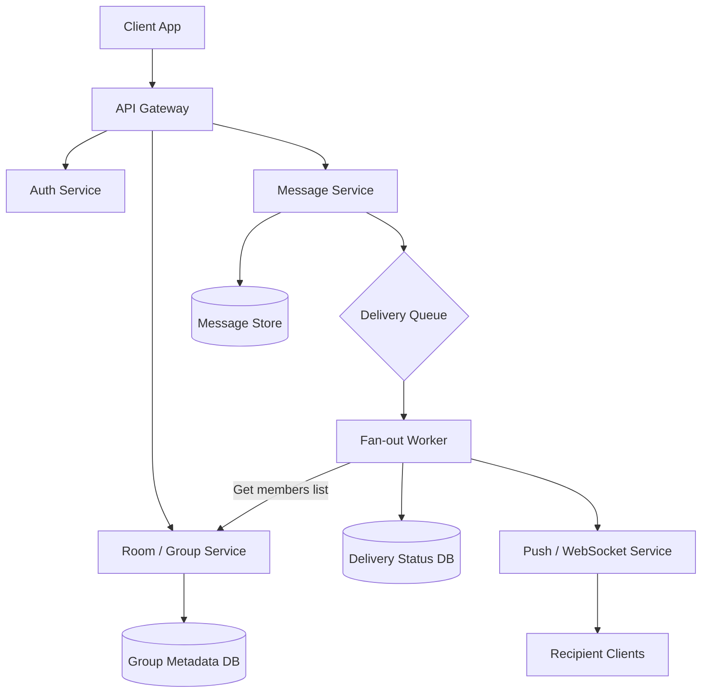
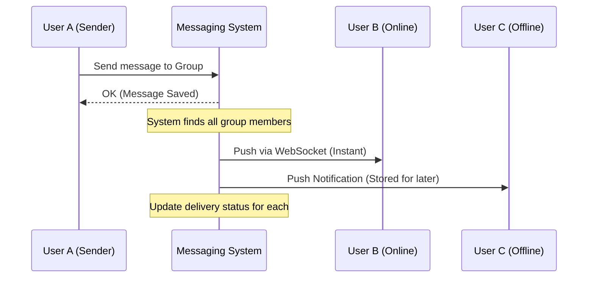
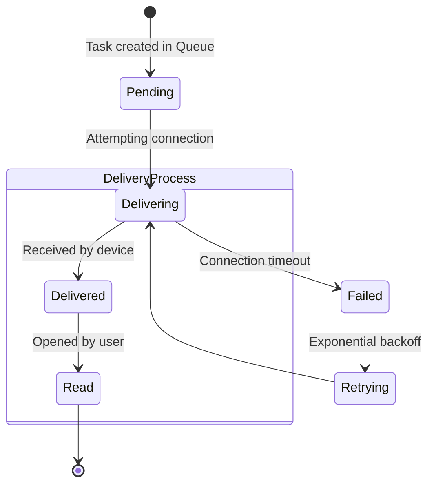

🧪 Laboratory Work 1
Variant 4 — Group Chat

Focus: Scaling delivery logic & Per-recipient status tracking

🧱 Part 1 — Component Diagram

To scale group messaging, we utilize the Fan-out pattern.
This allows the primary API to respond quickly to the sender while background workers handle distribution to every group member.

    
🔁 Part 2 — Sequence Diagram
Scenario

User A sends a message to a group. The system immediately confirms receipt and then asynchronously distributes it to other participants (User B, C, D, …).

🔄 Part 3 — State Diagram
Object

GroupMessageStatus — message state relative to a specific recipient.
We track the message state per participant to determine who has received or read it.

📚 Part 4 — ADR (Architecture Decision Record)

### ADR-004: Fan-out on Write for Group Messaging

**Status:** Accepted

### Context
In a group chat system, a single message must be delivered to **2–10,000+** participants.

We need to ensure:
- **Low latency** for the sender
- **Per-recipient delivery/read tracking**

### Decision
We implement a **Fan-out on Write** strategy using a message queue:
- **Message Service** persists the original message and enqueues a *fan-out* task
- **Fan-out Worker** consumes the task, retrieves the group members list, and creates individual delivery records
- **Statuses** are stored in a NoSQL DB (e.g., DynamoDB, Cassandra) using a composite key *(message_id + user_id)* for scalable writes

### Alternatives
- **Fan-out on Read**: clients pull messages instead of pushing
  - Hard to implement real-time delivery and read receipts
- **Synchronous fan-out**: the sender request distributes messages
  - Timeout risk for large groups (500+ users)

### Consequences
- **Performance:** sender receives immediate confirmation
- **Reliability:** failed worker → task stays in queue for retry
- **Data volume:** status records grow linearly → $O(N)$ per message
- **Complexity:** requires queue infrastructure (RabbitMQ / Kafka) and workers
